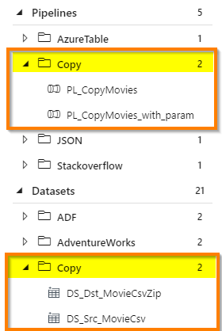
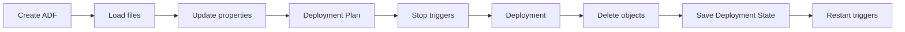
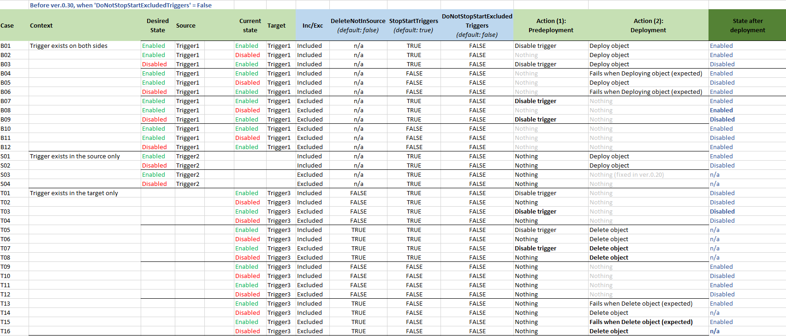
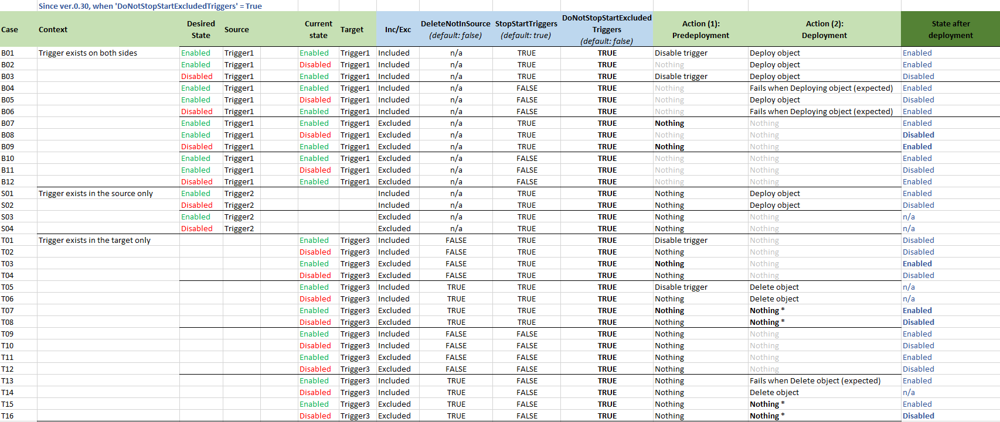
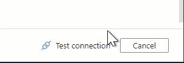
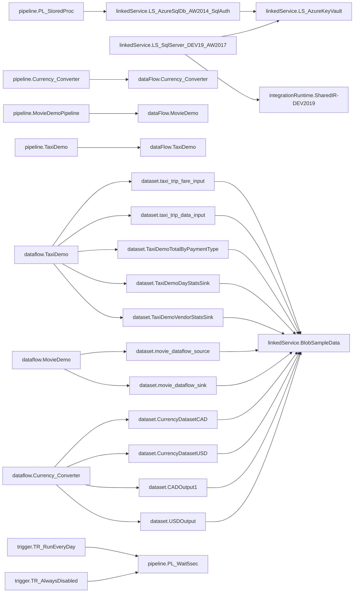

[](https://dev.azure.com/sqlplayer/azure.datafactory.tools/_build/latest?definitionId=26)

[](https://www.powershellgallery.com/packages/azure.datafactory.tools)


# azure.datafactory.tools


PowerShell module to help simplify Azure Data Factory CI/CD processes. This module was created to meet the demand for a quick and trouble-free deployment of an Azure Data Factory instance to another environment.  
The main advantage of the module is the ability to publish all the Azure Data Factory service code from JSON files by calling one method. The module supports now:  
* Creation of Azure Data Factory, if it doesn't exist
* Deployment of all type of objects: 
  - Pipelines, 
  - DataSets, 
  - Linked Services, 
  - (mapping & wrangling) Data Flows, 
  - Triggers, 
  - Integration Runtimes
  - Managed Virtual Network
  - Managed Private Endpoints
  - Credentials
* Finding the **right order** for deploying objects (no more worrying about object names)
* Built-in mechanism to replace, remove or add the properties with the indicated values (CSV and JSON file formats supported)
* Stopping/starting triggers
* Dropping objects when not exist in the source (code)  
  * Optionally can skip deletion of excluded objects
* Filtering (include or exclude) objects to be deployed by name and/or type **and/or folder**
* Filtering supports wildcards
* Publish options allow you to control:
  * Whether stop and restarting triggers
  * Whether delete or not objects not in the source
  * Whether create or not a new instance of ADF if it not exist
* Tokenisation in config file allows replace any value by Environment Variable or Variable from DevOps Pipeline
  * Allows to define multiple file (objects) by wildcarding
* Global Parameters
* Support for Managed VNET and Managed Private Endpoint 
* ⭐️ Incremental deployment (**NEW!**)
* Build function to support validation of files, dependencies and config
* Test connections (Linked Services)
* Generates mermaid dependencies diagram to be used in MarkDown type of documents

# Table of Content
- [azure.datafactory.tools](#azuredatafactorytools)
- [Table of Content](#table-of-content)
- [Known issues](#known-issues)
- [Overview](#overview)
  - [Support](#support)
- [How to start](#how-to-start)
  - [Install-Module](#install-module)
- [Publish Azure Data Factory](#publish-azure-data-factory)
  - [Where is my code?](#where-is-my-code)
- [Examples](#examples)
  - [Other environments (stage)](#other-environments-stage)
  - [Publish Options](#publish-options)
    - [Includes \& Excludes rules in a file](#includes--excludes-rules-in-a-file)
    - [Filtering file example](#filtering-file-example)
    - [Using Publish Options in deployment](#using-publish-options-in-deployment)
    - [Pattern (WildCard)](#pattern-wildcard)
  - [Publishing objects from selected ADF's folder only](#publishing-objects-from-selected-adfs-folder-only)
  - [Publishing Method](#publishing-method)
- [How it works](#how-it-works)
  - [Step: Create ADF (if not exist)](#step-create-adf-if-not-exist)
  - [Step: Load files](#step-load-files)
  - [Step: Replacing all properties environment-related](#step-replacing-all-properties-environment-related)
    - [Column TYPE](#column-type)
    - [Column NAME](#column-name)
    - [Column PATH](#column-path)
    - [Column VALUE](#column-value)
      - [Using Tokens as dynamic values](#using-tokens-as-dynamic-values)
    - [Stage parameter](#stage-parameter)
    - [Stage value as environment code/name](#stage-value-as-environment-codename)
    - [Stage value as full path to CSV config file](#stage-value-as-full-path-to-csv-config-file)
    - [JSON format of Config file](#json-format-of-config-file)
  - [Step: Deployment Plan](#step-deployment-plan)
  - [Step: Stoping triggers](#step-stoping-triggers)
  - [Step: Deployment of ADF objects](#step-deployment-of-adf-objects)
  - [Step: Save deployment state](#step-save-deployment-state)
  - [Step: Deleting objects not in source](#step-deleting-objects-not-in-source)
  - [Step: Restarting triggers](#step-restarting-triggers)
  - [Incremental Deployment](#incremental-deployment)
    - [How it works?](#how-it-works-1)
    - [Remember](#remember)
- [Selective deployment, triggers and logic](#selective-deployment-triggers-and-logic)
  - [Assumptions](#assumptions)
    - [StopStartTriggers](#stopstarttriggers)
    - [DoNotStopStartExcludedTriggers](#donotstopstartexcludedtriggers)
    - [Excluded (collection)](#excluded-collection)
    - [DoNotDeleteExcludedObjects](#donotdeleteexcludedobjects)
- [Build/Test Azure Data Factory code](#buildtest-azure-data-factory-code)
- [Test connection of Linked Service (preview)](#test-connection-of-linked-service-preview)
  - [Test connection with Service Principal (SPN)](#test-connection-with-service-principal-spn)
  - [Test connection with current Az PowerShell module context](#test-connection-with-current-az-powershell-module-context)
- [Generate dependencies diagram](#generate-dependencies-diagram)
- [Export ADF code to ArmTemplate](#export-adf-code-to-armtemplate)
    - [Parameters:](#parameters)
- [Publish ADF using ArmTemplate file(s) *(preview)*](#publish-adf-using-armtemplate-files-preview)
    - [Limitations. No support for:](#limitations-no-support-for)
- [Publish from Azure DevOps](#publish-from-azure-devops)
  - [Using Publish Azure Data factory (task)](#using-publish-azure-data-factory-task)
  - [Using Azure PowerShell (task)](#using-azure-powershell-task)
- [Release Notes](#release-notes)
- [Misc](#misc)
  - [New feature requests](#new-feature-requests)


# Known issues

- **[Native CDC](https://learn.microsoft.com/en-us/azure/data-factory/concepts-change-data-capture)** objects are not yet supported.

# Overview

This module works for Azure Data Factory **V2 only** and uses ```Az.DataFactory``` PowerShell module from Microsoft for the management of objects in ADF service.  

## Support

The module is compatible and works with Windows PowerShell 5.1, PowerShell Core 6.0 and above. This means you can use Linux-based agents in your Azure DevOps pipelines.

# How to start

## Install-Module

To install the module, open PowerShell command line window and run the following lines:

```powershell
Install-Module -Name azure.datafactory.tools -Scope CurrentUser
Import-Module -Name azure.datafactory.tools
```

If you want to upgrade module from a previous version:

```powershell
Update-Module -Name azure.datafactory.tools
```

Check your currently available version of module:
```powershell
Get-Module -Name azure.datafactory.tools
```

Source: https://www.powershellgallery.com/packages/azure.datafactory.tools


# Publish Azure Data Factory 

This module publishes all objects from JSON files stored by ADF in a code repository (collaboration branch). Bear in mind we are talking about *master* branch, NOT *adf_publish* branch.  
If you want to deploy from *adf_publish* branch - read this article: [Deployment of Azure Data Factory with Azure DevOps](https://azureplayer.net/2019/06/deployment-of-azure-data-factory-with-azure-devops/).

## Where is my code?
If you have never seen code of your Azure Data Factory instance - then you need to configure the code repository for your ADF. This article helps you to do that: [Setting up Code Repository for Azure Data Factory v2](https://azureplayer.net/2018/10/setting-up-code-repository-for-azure-data-factory-v2/).  
Once you have set up the code repository, clone the repo and pull (download) onto local machine. The folder structure should look like this:  
```
SQLPlayerDemo  
    dataflow  
    dataset  
    integrationRuntime  
    linkedService  
    pipeline  
    trigger  
```

Some of these folders might not exist when ADF has none of that kind of objects.

# Examples

Publish (entire) ADF code into ADF service in Azure:

```powershell
Publish-AdfV2FromJson 
   -RootFolder            <String>
   -ResourceGroupName     <String>
   -DataFactoryName       <String>
   -Location              <String>
   [-Stage]               <String>
   [-Option]              <AdfPublishOption>
   [-Method]              <String>
   [-DryRun]              <Switch>
```

Assuming your ADF is named ```SQLPlayerDemo``` and the code is located in ```c:\GitHub\AdfName\```, replace the values for *SubscriptionName*, *ResourceGroupName*, *DataFactoryName* and run the following command using PowerShell CLI:

```powershell
$SubscriptionName = 'Subscription'
Set-AzContext -Subscription $SubscriptionName
$ResourceGroupName = 'rg-devops-factory'
$DataFactoryName = "SQLPlayerDemo"
$Location = "NorthEurope"
$RootFolder = "c:\GitHub\AdfName\"
Publish-AdfV2FromJson -RootFolder "$RootFolder" -ResourceGroupName "$ResourceGroupName" -DataFactoryName "$DataFactoryName" -Location "$Location"
```

## Other environments (stage)

Use optional ```[-Stage]``` parameter to prepare json files of ADF with appropriate values for properties and deploy to another environment correctly. See section: **How it works / Step: Replacing all properties environment-related** for more details.  


## Publish Options

The options allows you control which objects should be deployed by including or excluding them from the list. First of all you need to create the object:

```powershell
# Example 0: Creating Publish Option object
$opt = New-AdfPublishOption
```
`AdfPublishOption` contains the following options:  
* [HashTable] **Includes** - defines a list of objects to be published (default: *empty*)  
* [HashTable] **Excludes** - defines a list of objects to be NOT published (default: *empty*)  
* [Boolean] **DeleteNotInSource** - indicates whether the objects not in the source should be deleted or not (default: *false*)  
* [Boolean] **StopStartTriggers** - indicates whether the triggers would be stopped and restarted during the deployment (default: *true*)
* [Boolean] **CreateNewInstance** - specifies whether the target ADF should be created when it does not exist. When target ADF doesn't exist and this option is set to *false* then `Publish-AdfV2FromJson` function fails.  (default: *true*)  
* [Boolean] **DeployGlobalParams** - indicates whether deploy Global Parameters of ADF. Nothing happens when parameters are not defined. (default: *true*)
* [Boolean] **FailsWhenConfigItemNotFound** - indicates whether configuration items not found fails the script. (default: *true*)
* [Boolean] **FailsWhenPathNotFound** - indicates whether missing paths fails the script. (default: *true*)
* [Boolean] **DoNotStopStartExcludedTriggers** - specifies whether excluded triggers will be stopped before deployment (default: *false*)
* [Boolean] **DoNotDeleteExcludedObjects** - specifies whether excluded objects can be removed. Applies when `DeleteNotInSource` is set to *True* only. (default: *true*) 
* [Boolean] **IncrementalDeployment** - specifies whether Incremental Deployment mode is enabled (default: *false*) 
* [String] **IncrementalDeploymentStorageUri** - indicates Azure Storage where the latest deployment state file is stored (no default) 
* [Enum] **TriggerStopMethod** - determines which triggers should be stopped.  
  Available values: `AllEnabled` (default) | `DeployableOnly`  
  Find more about the above option in section [Step: Stoping triggers](#step-stoping-triggers)
* [Enum] **TriggerStartMethod** - determines which triggers should be started.  
  Available values: `BasedOnSourceCode` (default) | `KeepPreviousState`  
  Find more about the above option in section [Step: Restarting triggers](#step-restarting-triggers)


Subsequently, you can define the needed options:

```powershell
# Example 1: Including objects by type and name pattern
$opt = New-AdfPublishOption
$opt.Includes.Add("pipeline.Copy*", "")
$opt.DeleteNotInSource = $false

# Example 2: Excluding objects by type
$opt = New-AdfPublishOption
$opt.Excludes.Add("linkedService.*", "")
$opt.Excludes.Add("integrationruntime.*", "")
$opt.Excludes.Add("trigger.*", "")

# Example 3: Excluding all objects from deployment
$opt = New-AdfPublishOption
$opt.Excludes.Add("*", "")
$opt.StopStartTriggers = $false

# Example 4: Including only one object to deployment
$opt = New-AdfPublishOption
$opt.Includes.Add("pipeline.Wait1", "")
$opt.StopStartTriggers = $false

# Example 5: Ignore missing configuration items (will just write warning to standard output instead)
$opt = New-AdfPublishOption
$opt.FailsWhenConfigItemNotFound = $false

# Example 6: Ignore missing paths (will just write warning to standard output instead)
$opt = New-AdfPublishOption
$opt.FailsWhenPathNotFound = $false

# Example 7: Exclude Infrastructure-type of objects from deployment
$opt = New-AdfPublishOption
$opt.CreateNewInstance = $false
$opt.Excludes.Add("integrationruntime.*", "")
$opt.Excludes.Add("managedVirtualNetwork*.*", "")
```

> Bear in mind that *Includes* and *Excludes* lists are **rules out each other**.  
Objects would be excluded from deployment only if *Includes* list remains empty.  
When both lists are empty - all objects going to be published.

### Includes & Excludes rules in a file

You can define set of filtering rules (includes/excludes) in a file and load all of them when creating *Publish Option* objects:
```powershell
# Example 5: Creating Publish Option object with an initialised rules
$opt = New-AdfPublishOption -FilterFilePath ".\deployment\rules.txt"
```
Because one file contains all rules - there is a way to differentiate *Include* rules from *Exclude*.  
Therefore, an extra character should be provided before the name/pattern:
* `+` (plus) - for objects you want to include to a deployment
* `-` (minus) - for objects you want to exclude from a deployment  

> If char (+/-) is not provided – an inclusion rule (+) would be applied.

### Filtering file example

```
+pipeline.*
trigger.*
-*.SharedIR*
-*.LS_SqlServer_DEV19_AW2017
-*.*@testFolder
```

The above file (if used) adds:
- 2 items to *Includes* list (line 1-2)
- 2 items to *Excludes* list (line 3-4)
- all items located in `testFolder` to *Excludes* list (line 5)

> The file should use UTF-8 encoding.


### Using Publish Options in deployment

Once you define all necessary options, just add the parameter to the **Publish** function:  
```powershell
Publish-AdfV2FromJson -RootFolder "$RootFolder" `
   -ResourceGroupName "$ResourceGroupName" `
   -DataFactoryName "$DataFactoryName" `
   -Location "$Location" `
   -Option $opt
```

### Pattern (WildCard)
As you probably noticed, you can use some patterns when defining name or type for objects to be included or excluded to/from deployment. 
To determine whether an object matches to the pattern (wildcard) - module uses the `-like` operator, as known in PowerShell.
Therefore you can use the following combinations:  
```
trigger.*
dataset.DS_*
*.PL_*@test*
linkedService.???KeyVault*
pipeline.ScdType[123]
trigger.*@testFolder
managedVirtualNetwork*.*
*managedPrivateEndpoint.*
factory.*
```
Full name of objects supported by the module is built of: `{Type}.{Name}@{Folder}`  
All potential combinations can be found in code repository of ADF:  
*Type* - name of folder  
*Name* - name of file (without JSON extension)  
*Folder* - name of (ADF) folder to which objects belong to

> More info about wildcard: [About Wildcard](https://docs.microsoft.com/en-gb/powershell/module/microsoft.powershell.core/about/about_wildcards?view=powershell-5.1)

## Publishing objects from selected ADF's folder only
Although providing a pattern of selected object names to be published gives great flexibility in terms of part-deployment, it might not cover other scenarios. When your ADF has objects organised in folders, you may want to publish objects only within that folder, no matter what will change in the future.  
Let's take the following ADF as an example:  

  
If you want to publish only objects from "Copy" folder(s), you must perform three steps before publishing:
1) Load all ADF objects from your code (local folder)
2) Execute function which returns list of objects located in selected folder in ADF
3) Add returned list (of objects) to **Includes** in **Publish Option**
> Sounds complicated? You have tools to do all those things!
```PowerShell
# Step 1
$adf = Import-AdfFromFolder -RootFolder "$RootFolder" -FactoryName $DataFactoryName

# Step 2
$list1 = $adf.GetObjectsByFolderName('Copy')

# Step 3
$opt = New-AdfPublishOption
$opt.Includes += $list1

# Finally: Run Publish as usual
Publish-AdfV2FromJson -RootFolder "$RootFolder" -ResourceGroupName "$ResourceGroupName" -DataFactoryName "$DataFactoryName" -Location "$Location" -Option $opt
```

Naturally, you can add more objects from different folder. Just repeat steps 2-3:
```PowerShell
$list2 = $adf.GetObjectsByFolderName('JSON')
$opt.Includes += $list2
```

> **Remember:** Current version will not publish related objects when list of objects would be provided in *Includes* publish options. You must ensure that all dependent objects are already exist on target ADF service.

## Publishing Method

Parameter: ```Method``` (optional)  
Currently ```Publish-AdfV2FromJson``` cmdlet contains two methods of publishing: 
* AzDataFactory, 
* AzResource *(default)*.  

**AzResource** method has been introduced in version 0.9.0 due to bugs in **Az.DataFactory** PowerShell module and uses **Az.Resources** module to deploy Data Factory resources. However, if you still want to use Az.DataFactory module for deployments for any reasons - just use this parameter and specify the first method.


# How it works

This section describes what the function ```Publish-AdfV2FromJson``` does step by step.



## Step: Create ADF (if not exist)

💬 In log you'll see line: `STEP: Verifying whether ADF exists...`

You must have appropriate permission to create new instance.  
*Location* parameter is required for this action.

If ADF does exist and `IncrementalDeployment` is ON, the process loads latest **Deployment State** from Storage.
Note: The above flag will be disabled when related parameter (`IncrementalDeploymentStorageUri`) is empty.

## Step: Load files

💬 In log you'll see line: `STEP: Reading Azure Data Factory from JSON files...`

This step reads all local (json) files from a given directory (`rootfolder`).


## Step: Replacing all properties environment-related

💬 In log you'll see line: `STEP: Replacing all properties environment-related...`

This step will be executed only when `[Stage]` parameter has been provided.  
The whole concept of CI & CD (Continuous Integration and Continuous Delivery) process is to deploy automatically and without risk onto target infrastructure, supporting multi-environments. Each environment (or stage) has to be exactly the same code except for selected properties. Very often these properties are:  
- Data Factory name
- Azure Key Vault URL (endpoint)
- Selected properties of Linked Services 
- Some variables
- etc.

All these values are hold among JSON files in the code repository and due to their specifics - they are not parameterised as it happens in ARM template.
That's why we need to replace the selected object's parameters into one specified for particular environment. The changes must be done just before deployment.

In order to address those needs, the process is able to read flat **configuration file** with all required values **per environment**. Below is an example of such config file:
```
type,name,path,value
linkedService,LS_AzureKeyVault,typeProperties.baseUrl,"https://kv-blog-uat.vault.azure.net/"
linkedService,LS_BlobSqlPlayer,typeProperties.connectionString,"DefaultEndpointsProtocol=https;AccountName=blobstorageuat;EndpointSuffix=core.windows.net;"
pipeline,PL_CopyMovies,activities[0].outputs[0].parameters.BlobContainer,UAT
pipeline,PL_CopyMovies_with_param,parameters.DstBlobContainer.defaultValue,UAT
pipeline,PL_Wait_Dynamic,parameters.WaitInSec,"{'type': 'int32','defaultValue': 22}"
# This is comment - the line will be omitted
```
> You can replace any property with that method.

There are 4 columns in CSV file:
- `type` - Type of object. It's the same as folder where the object's file located
- `name` - Name of objects. It's the same as json file in the folder
- `path` - Path of the property's value to be replaced within specific json file
- `value` - Value to be set

### Column TYPE

Column `type` accepts one of the following values only:
- integrationRuntime
- pipeline
- dataset
- dataflow
- linkedService
- trigger
- managedVirtualNetwork
- managedPrivateEndpoint
- factory *(for Global Parameters)*
- credential

### Column NAME

This column defines an object. Since version 0.19, you can speficy the **name** using wildcards. That means rather than duplicating lines for the same configuration (path&value) for multiple files, you can define only one line in config.

### Column PATH

Unless otherwise stated, mechanism always **replace (update)** the value for property. Location for those Properties are specified by `Path` column in Config file.  
Additionally, you can **remove** selected property altogether or **create (add)** new one. To define the desired action, put character `+` (plus) or `-` (minus) just before Property path:

* `+` (plus) - Add new property with defined value
* `-` (minus) - Remove existing property  

When using paths that reference items within an array, you have two options for keying into the array:
* Integer key (0 based)
* If all items in the array have the property ```name```, we can use that value as the key, eg for pipeline activities.

See example below:
```
type,name,path,value
# As usual - this line only update value for connectionString:
linkedService,BlobSampleData,typeProperties.connectionString,"DefaultEndpointsProtocol=https;AccountName=sqlplayer2019;EndpointSuffix=core.windows.net;"

# MINUS means the desired action is to REMOVE encryptedCredential:
linkedService,BlobSampleData,-typeProperties.encryptedCredential,
# PLUS means the desired action is to ADD new property with associated value:
linkedService,BlobSampleData,+typeProperties.accountKey,"$($Env:VARIABLE)"
factory,BigFactorySample2,"$.properties.globalParameters.'Env-Code'.value","PROD"

# Multiple following configurations for many files:
dataset,DS_SQL_*,properties.xyz,ABC

# Change a pipeline activity timeout using integer and name based indexers
pipeline,PL_Demo,activities[1].typeProperties.waitTimeInSeconds,30
pipeline,PL_Demo,activities["Copy Data"].typeProperties.waitTimeInSeconds,30

# Update the value of existing Global Parameter:
factory,BigFactorySample2,"$.properties.globalParameters.envName.value",POC

# Create NEW Global Parameter:
factory,BigFactorySample2,"+$.properties.globalParameters.NewGlobalParam.value",2023
factory,BigFactorySample2,"+$.properties.globalParameters.NewGlobalParam.type",int
```

> When you use `$` at the beginning of the path it refers to root element of the JSON file. 
> Otherwise, it applies relative path starting from `properties` node. 
In other words, these two paths pointing the same element:
```
linkedService,LS_AzureKeyVault,typeProperties.baseUrl,"https://kv-sqlplayer.vault.azure.net/"
linkedService,LS_AzureKeyVault,$.properties.typeProperties.baseUrl,"https://kv-sqlplayer.vault.azure.net/"
```

### Column VALUE

You can define 3 types of values in column `Value`: number, string, (nested) JSON object.  
If you need to use comma (,) in `Value` column - remember to enclose entire value within double-quotes ("), like in this example below:
```
pipeline,PL_Wait_Dynamic,parameters.WaitInSec,"{'type': 'int32','defaultValue': 22}"
```

#### Using Tokens as dynamic values
You can use token syntax to define expression which should be replaced by value after reading CSV config file process. Currently PowerShell expression for environment is supported, which is: `$Env:VARIABLE` or `$($Env:VARIABLE)`.  
Assuming you have an *Environment Variable* name `USERDOMAIN` with value `CONTOSO`, this line from config file:
```
linkedService,AKV,typeProperties.baseUrl,"https://$Env:USERDOMAIN.vault.azure.net/"
```
will become that one after reading from disk:
```
linkedService,AKV,typeProperties.baseUrl,"https://CONTOSO.vault.azure.net/"
```

Having that in mind, you can leverage variables defined in Azure DevOps pipeline to replace tokens without extra task. This is possible because all pipeline's variables are available as environment variables within the agent.


### Stage parameter

This parameter is optional. When defined, the process will replace all properties defined in (csv) configuration file.
The parameter can be either full path to csv file (must ends with .csv) or just stage name.
When you provide parameter value 'UAT' the process will try open config file located `.\deployment\config-UAT.csv`

> Use the optional [-Stage] parameter when executing ```Publish-AdfV2FromJson``` module to replace values for/with properties specified in config file(s).

There are 2 ways to provide value for `Stage` parameter:  
### Stage value as environment code/name

You can provide short environment code, e.g. UAT, PROD for `Stage` parameter.  
In that case, planning deployment into UAT and PROD environments you need to create these files (subfolder `deployment` in relation to main ADF location):
```
SQLPlayerDemo  
    dataflow  
    dataset
    deployment               (new folder)  
        config-uat.csv       (file for UAT environment)
        config-prod.csv      (file for PROD environment)
    factory
    integrationRuntime  
    linkedService  
    pipeline  
    trigger  
```
> File name must follow the pattern: **config-{stage}.csv** and be located in folder named: **deployment**.


### Stage value as full path to CSV config file
The second way is to provide full path to configuration file.  
For example, if you provide `c:\MyCode\adf\uat-parameters.csv`, an exact file will be use to read configuration as the value ends with ".csv". Although, in that case, the file may be located anywhere, it's recommended to keep them along with other ADF files. 

### JSON format of Config file
If you prefer using JSON rather than CSV for setting up configuration - JSON files are also supported now. In that case, `Stage` parameter must be set with full path to configuration file. Take a look at the following example: 
```JSON
{
  "LS_AzureDatabricks": [
    {
      "name": "$.properties.typeProperties.existingClusterId",
      "value": "$($Env:DatabricksClusterId)",
      "action": "add"
    },
    {
      "name": "$.properties.typeProperties.encryptedCredential",
      "value": "",
      "action": "remove"
    }
  ],
  "LS_AzureKeyVault": [
    {
      "name": "$.properties.typeProperties.baseUrl",
      "value": "https://kv-$($Env:Environment).vault.azure.net/",
      "action": "update"
    }
  ],
  "PL_Demo": [
    {
      "name": "$.activities[1].typeProperties.waitTimeInSeconds",
      "value": "30",
      "action": "update"
    },
    {
      "name": "$.activities['Copy Data'].typeProperties.waitTimeInSeconds",
      "value": "30",
      "action": "update"
    }
  ]
}
```


## Step: Deployment Plan

💬 In log you'll see line: `STEP: Determining the objects to be deployed...`

This step identifies objects to be deployed using `Includes` and `Excludes` list provided in *Publish Options*.  
Afterwards, if `IncrementalDeployment = true`, it excludes objects by comparing hashes from **Deployment State** to hashed of awaiting objects.


## Step: Stoping triggers

💬 In log you'll see line: `STEP: Stopping triggers...`

This block stops all triggers which must be stopped due to deployment.  
By default the process stops **all active** triggers when `TriggerStopMethod = AllEnabled` (default setting).
However, it makes sense to use option `TriggerStopMethod = DeployableOnly` when one does selective or incremental deployment which would omit some triggers from being stopped.  
Another way to control which triggers you want to omit from stopping is by adding such triggers to `Excludes` list and set flag `DoNotStopStartExcludedTriggers` to *true*.

> The step might be skipped when `StopStartTriggers = false` in *Publish Options*

## Step: Deployment of ADF objects

💬 In log you'll see line: `STEP: Deployment of all ADF objects...`

This step is actually responsible for doing all the stuff.
The mechanism is smart enough to publish all objects in the right order, thence a developer doesn't need to care of object names due to deployment failure any longer.
> Find out *Publish Option* capabilities in terms of filtering objects intended to be deployed.


## Step: Save deployment state

💬 In log you'll see line: `STEP: Updating (incremental) deployment state...`

After the deployment, in this step the tool prepares the list of deployed objects and their hashes (MD5 algorithm). 
The array is wrap up in json format and stored as blob file `{ADF-Name}.adftools_deployment_state.json` in provided Storage.  
**Deployment State** speeds up future deployments by identifying objects have been changed since last time.

> The step might be skipped when `IncrementalDeployment = false` in *Publish Options*.   
> You'll see warning in the console (log) when `IncrementalDeployment = true` and `IncrementalDeploymentStorageUri` is empty.


## Step: Deleting objects not in source

💬 In log you'll see line: `STEP: Deleting objects not in source ...`

This process removes all objects from ADF service whom couldn't be found in the source (ADF code).  
The mechanism is smart enough to dropping the objects in right order.  
Furthermore, you can better control which objects you want to omit from removing. Only need to add such objects to `Excludes` list and set flag `DoNotDeleteExcludedObjects` to *true*. 

> The step might be skipped when `DeleteNotInSource = false` in *Publish Options*

## Step: Restarting triggers

💬 In log you'll see line: `STEP: Starting triggers...`

Restarting all triggers that should be enabled.  
Since v.1.6 you have more control of which triggers should be started. Use `TriggerStartMethod` in *Publish Option* to set one of the following values:
- **BasedOnSourceCode** (default) - uses source files and config file entries to determine desired status of triggers
- **KeepPreviousState** - statuses from source or config files are ignored. In this case, the process remembers statuses before deployment (when stopping triggers) and the restores those statuses after the deployment. The status will be "disable" (trigger stopped) for any newly created trigger.

> The step might be skipped when `StopStartTriggers = false` in *Publish Options*

## Incremental Deployment

> This is new feature (ver.1.4) in public preview. Since ver.1.10 the process doesn't use ADF Global Parameter to keep Deployment State data. You must provide Storage URL instead.

Usually the deployment process takes some time as it must go through all object (files) and send them via REST API to be deployed. The more objects in ADF the longer process takes.  
In order to speed up the deployment process, you may want to use new switch `IncrementalDeployment` (new in *Publish Options*) to enable smart process of identify and deploy only objects that have been changed since last deployment.  

### How it works?
It uses **Deployment State** kept in as json file and is write/read to/from Azure BLOB Storage.  
When the mode is ON, the process does a few additional steps across entire deployment process:
1. Reads Deployment State (json file) from Storage to get previous **Deployment State**
2. Identifies which objects are unchanged and excludes them from deployment 
3. Calculates MD5 hashes of deployed objects and merges them to previous **Deployment State**
4. Saves **Deployment State** as `{ADFName}.adftools_deployment_state.json` file in Storage

> Note: In order to use this feature, the following option parameters must be set:
> - `IncrementalDeployment` = `True` 
> - `IncrementalDeploymentStorageUri` =  `https://sqlplayer2020.file.core.windows.net/adftools` (example)

### Remember
* Incremental Deployment assumes that no one changes ADF objects manually in the cloud
* Objects' hashes are calculate after update of properties. If you change config for an object - it will be deploy
* If you want to redeploy all objects again, you've got two options:
  * Set `IncrementalDeployment = false` OR
  * Delete Deployment State (json) file manually from provided Storage account's location


# Selective deployment, triggers and logic

Publishing only selected objects of ADF is not an easy thing. If you add dependencies between objects and a need of stopping triggers before deploying on top of that - the situation becomes even more difficult. Therefore, not always it might be obvious what would happen during the deployment while you have flags set up, an object exist (or not) in the source and/or a trigger is Enabled (or Disabled) on target ADF service where you deploy to.  
All these factors:
* Does object exist in the source?
* Is trigger is Enabled in the target?
* What is the value for `DeleteNotInSource` flag?
* What is the value for `StopStartTriggers` flag?
* What is the value for `DoNotStopStartExcludedTriggers` flag?
* What is the value for `DoNotDeleteExcludedObjects` flag?
* Is an object on `Excludes` list?  

had to be considered thoroughly, hence the following tables arose:

The above table shows behaviour for different input parameter variations for all version before 0.30, or for newest version when option `DoNotStopStartExcludedTriggers` is set to *False*.


The above table shows behaviour for different input parameter variations for newest version (since v0.30) when option `DoNotStopStartExcludedTriggers` is set to *True*.  
One can spot some small differences in particular cases, which should offer you enough flexibility to manage all your scenarios.

## Assumptions

It's worth to explain a bit why the behaviour looks as above.

### StopStartTriggers 
It allows you to decide. It stops ALL existing and `Started` (Enabled) triggers.  
Generally you should use TRUE (default) if you want to avoid troubles.  
However, if you choose FALSE - you must accept that process WILL NOT touch triggers. You can still do it for yourself in pre or post-deployment script.

### DoNotStopStartExcludedTriggers
In some scenarios, people still want to let process to manage of triggers, but with some exceptions.
Usage of this flag make sense along with `StopStartTriggers` only and when some objects are excluded from deployment.
It guarantees that no objects (excluded) will be even touched in target service during the deployment.

### Excluded (collection) 
This option should allow to completely separate group of objects from other group.
In that way you can keep all files in the source but control behaviour with flags.
Exclusion can be defined in two ways:
1) Explicitly in 'Excludes' collection
2) Implicitly by not adding an item to 'Includes' collection

**Important:** Both collections can use wildcards as the name of objects.  
It simplify defining multiple objects by one line, or defining objects which does not exist yet.
These collections are very useful while you want to do a selective deployment.

### DoNotDeleteExcludedObjects
Excluded object can be deleted only if flag `DoNotDeleteExcludedObjects` = false.
This situation could cause error when trigger has not been deleted prior.
Otherwise, nothing will happen.  
This option gives you a flexibility of deleting objects in the target, but still not touching objects from 'other' group.


# Build/Test Azure Data Factory code

Another very helpful function is `Test-AdfCode`. Use it to validate the code of your Azure Data Factory before you publish it onto target ADF service.
The function validates files of ADF in a given location, returning warnings or errors.  
The following validation will be perform:
- Reads all files and validates its json format
- Checks whether all dependant objects exist
- Checks whether file name equals object name
- (more soon...)

```PowerShell
# Example 1
Test-AdfCode -RootFolder "$RootFolder"
```

Parameters:  
- `RootFolder` - Source folder where all ADF objects are kept. The folder should contain subfolders like pipeline, linkedservice, etc.

The cmdlet returns number of found errors, 0 (zero) = all good.

# Test connection of Linked Service (preview)

This allows you to automate test connections, which normally you can only do via browser in ADF UX by clicking `Test connection` button:


> Note that the function uses undocumented API call (testConnectivity).

## Test connection with Service Principal (SPN)
It required Service Principal (Reg App) registered in AAD.

```PowerShell
# Prep
$params = @{
    DataFactoryName   = 'adf-example-uat'
    ResourceGroupName = 'rg-example-uat' 
    SubscriptionID    = "{Your-subscriptionId-here}" 
    TenantID          = "{Your-tenantId-here}"
    ClientID          = "SPN-ApplicationId"
    ClientSecret      = "SPN-Password"
}

# Example 1
$LinkedServiceName = 'AzureSqlDatabase1'      
$r = Test-AdfLinkedService @params -LinkedServiceName $LinkedServiceName
$r | Format-Table

# Example 2
$LinkedServiceNames = 'AzureSqlDatabase1,LS_ADLS'   # Comma-separated list   
$r = Test-AdfLinkedService @params -LinkedServiceName $LinkedServiceNames
$r.Report
```

Parameters:  
- `LinkedServiceName` - ADF Linked Service to be tested
- `DataFactoryName`   - ADF you want to test
- `ResourceGroupName` - Azure Resource Group which ADF belongs to
- `SubscriptionID`    - Subscription (Guid)
- `TenantID`          - Tenant ID
- `ClientID`          - ApplicationId of Service Principal (SPN)
- `ClientSecret`      - Password of Service Principal (SPN)

More about Service Principal Objects in Microsoft Doc: [Application and service principal objects in Azure Active Directory](https://docs.microsoft.com/en-us/azure/active-directory/develop/app-objects-and-service-principals)


## Test connection with current Az PowerShell module context
```PowerShell
# Prep
$params = @{
    DataFactoryName   = 'adf-example-uat'
    ResourceGroupName = 'rg-example-uat' 
    SubscriptionID    = "{Your-subscriptionId-here}" # or (Get-AzContext).Subscription.Id if using context directly
}

# Example 1
$LinkedServiceName = 'AzureSqlDatabase1'      
$r = Test-AdfLinkedService @params -LinkedServiceName $LinkedServiceName
$r | Format-Table

# Example 2
$LinkedServiceNames = 'AzureSqlDatabase1,LS_ADLS'   # Comma-separated list   
$r = Test-AdfLinkedService @params -LinkedServiceName $LinkedServiceNames
$r.Report
```

Parameters:  
- `LinkedServiceName`   - ADF Linked Service to be tested
- `DataFactoryName`     - ADF you want to test
- `ResourceGroupName`   - Azure Resource Group which ADF belongs to
- `SubscriptionID`      - Subscription (Guid)

# Generate dependencies diagram

If you want to see all ADF objects and its dependencies on one page - now you can.
Once you read all objects from JSON files (by using other well-known `Import-AdfFromFolder` cmdlet), just execute cmdlet called `Get-AdfDocDiagram` which return the diagram in [Mermaid format](https://mermaid-js.github.io/mermaid/), used and support in MarkDown (MD) documentation files. Then use the file in [Azure DevOps Wiki page](https://docs.microsoft.com/en-us/azure/devops/project/wiki/wiki-markdown-guidance?view=azure-devops), GitHub, or any other tools that supports MD format.

Example:
```PowerShell
# First of all: Load ADF code from given location
$RootFolder = "c:\GitHub\AdfName\"
$adf = Import-AdfFromFolder -RootFolder $RootFolder -FactoryName 'whatever'

# Execute the following command to generate diagram as MarkDown text code 
Get-AdfDocDiagram -adf $adf 

# You can change direction of output diagram:
Get-AdfDocDiagram -adf $adf -direction 'TD'

# Write output diagram to file:
Get-AdfDocDiagram -adf $adf | Set-Content -Path 'adf-diagram.md'
```

Result:



# Export ADF code to ArmTemplate
Cmdlet: `Export-AdfToArmTemplate`  
This cmdlet uses [**ADFUtilities** NPM package](https://www.npmjs.com/package/@microsoft/azure-data-factory-utilities) provided by Microsoft. 
It does exactly the same actions as you can do with ADF UI by clicking **Validate all** and then **Export ARM Template**.

### Parameters:  
- `RootFolder` - Source folder where all ADF objects are kept. The folder should contain subfolders like pipeline, linkedservice, etc.
- `SubscriptionId` - Optional.
- `ResourceGroup` - Optional.
- `AdfUtilitiesVersion`- Optional.


# Publish ADF using ArmTemplate file(s) *(preview)*
Cmlet: `Publish-AdfV2UsingArm`  
Publishes Azure Data Factory from ARM Template files into target ADF service.
Additionaly, creates a data factory with the specified resource group name and location, if that doesn't exist.
Uses standard New-AzResourceGroupDeployment method in order to create new deployment in a given Resource Group.
> **Preview**  
> Please note that input parameters can change over time and even though the cmdlet uses very well known deployment approach, does not support many features as its deployment from code `Publish-AdfV2FromJson` counterpart.

### Limitations. No support for:
- Start/Stop triggers applied by Microsoft's pre/post deployment script
- No support for Selective deployment
- No parameter substitution


# Publish from Azure DevOps

There are two ways you can deploy Azure Data Factory with this approach (directly from code) within Azure DevOps Pipeline using:  
* Publish Azure Data factory task (recommended)
* Azure PowerShell task

## Using Publish Azure Data factory (task)

Custom Build/Release Task for Azure DevOps has been prepared as a very convenient way of configuring deployment task in Release Pipeline (Azure DevOps). Although it's only UI put on top of azure.datafactory.tools PS module, it gives users great experience if they don't have PowerShell skills or perhaps prefer using a clear and simple fields configuration approach.  
The "Publish Azure Data factory" task is available for free and open-source. 
You can install it from Microsoft MarketPlace onto your organisation.  
More information: [Marketplace](https://marketplace.visualstudio.com/items?itemName=SQLPlayer.DataFactoryTools)
| [Source code and documentation](https://github.com/Azure-Player/azure.datafactory.devops)

## Using Azure PowerShell (task)

Having this as a PowerShell module, it is very easy to configure a Release Pipeline in Azure DevOps to publish ADF code as if it was running from a local machine. All the steps you must create are:  
- Download & install ```Az.DataFactory``` and ```azure.datafactory.tools``` PowerShell modules
- Execute ```Publish-AdfV2FromJson``` method with parameters

Both steps you can be found here:  
```powershell
# Step 1
Install-Module Az.DataFactory -MinimumVersion "1.10.0" -Force
Install-Module -Name "azure.datafactory.tools" -Force
Import-Module -Name "azure.datafactory.tools" -Force

# Step 2
Publish-AdfV2FromJson -RootFolder "$(System.DefaultWorkingDirectory)/_ArtifactName/" -ResourceGroupName "$(ResourceGroupName)" -DataFactoryName "$(DataFactoryName)" -Location "$(Location)" -Stage "$(Release.EnvironmentName)"
```

YAML:
```yaml
variables:
  ResourceGroupName: 'rg-devops-factory'
  DataFactoryName: 'SQLPlayerDemo'
steps:
- powershell: |
   Install-Module Az.DataFactory -MinimumVersion "1.10.0" -Force
   Install-Module -Name "azure.datafactory.tools" -Force
   Import-Module -Name "azure.datafactory.tools" -Force
  displayName: 'PowerShell Script'
steps:
- task: AzurePowerShell@4
  displayName: 'Azure PowerShell script: InlineScript'
  inputs:
    azureSubscription: 'Subscription'
    ScriptType: InlineScript
    Inline: |
     Publish-AdfV2FromJson -RootFolder "$(System.DefaultWorkingDirectory)/_ArtifactName_/" -ResourceGroupName "$(ResourceGroupName)" -DataFactoryName "$(DataFactoryName)" -Location "$(Location)" -Stage "$(Release.EnvironmentName)"
     
    FailOnStandardError: true
    azurePowerShellVersion: LatestVersion```
```

# Release Notes

New features, bug fixes and changes [can be found here](https://github.com/SQLPlayer/azure.datafactory.tools/blob/master/changelog.md).

# Misc

## New feature requests
Tell me your thoughts or describe your specific case or problem.  
For any requests on new features please raise a new issue here: [New issue](https://github.com/SQLPlayer/azure.datafactory.tools/issues)  

More articles and useful links on [SQLPlayer blog - ADF page](https://sqlplayer.net/adf/).
