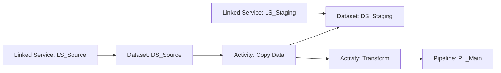

# Generate Dependencies Diagram

**Related:** [Build & Test](BUILD_AND_TEST.md) | [Main Documentation](../../README.md)

## Overview

The module can generate a **Mermaid diagram** showing dependencies between ADF objects. This is useful for:
- Understanding object relationships
- Including in documentation
- Visualizing deployment order
- Debugging dependency issues

## Generating a Diagram

```powershell
# Load ADF from source
$adf = Import-AdfFromFolder -RootFolder $RootFolder -FactoryName $DataFactoryName

# Generate mermaid diagram
$diagram = Get-AdfObjectsDependenciesMermaidDiagram -AdfInstance $adf

# Save to file
$diagram | Out-File -FilePath './diagram.md' -Encoding UTF8
```

## Using Diagram in Markdown

The generated Mermaid diagram can be included in markdown files:

### In GitHub/Azure DevOps Repos

```markdown
# Data Factory Architecture

## Object Dependencies

\`\`\`mermaid
<diagram content>
\`\`\`
```

### Standalone Mermaid File

Create `diagram.md`:
```markdown
# ADF Dependencies

\`\`\`mermaid
<diagram content>
\`\`\`
```

Then view in:
- GitHub (renders automatically)
- Azure DevOps (renders in wiki)
- [Mermaid Live Editor](https://mermaid.live)

## Example Diagram Output



## Complete Example

```powershell
# Parameters
$RootFolder = 'c:\GitHub\MyADF\'
$DataFactoryName = 'MyADF'
$DiagramPath = 'c:\output\dependencies.md'

# Load ADF code
$adf = Import-AdfFromFolder -RootFolder $RootFolder -FactoryName $DataFactoryName

# Generate diagram
$diagram = Get-AdfObjectsDependenciesMermaidDiagram -AdfInstance $adf

# Save to file
$diagram | Out-File -FilePath $DiagramPath -Encoding UTF8

Write-Host "Diagram saved to: $DiagramPath"
```

## Including Diagram in README

Add to your project README.md:

```markdown
# MyADF - Data Factory Project

## Object Dependencies

\`\`\`mermaid
<diagram content>
\`\`\`

See full documentation in [PUBLISHING.md](docs/GUIDE/PUBLISHING.md)
```

## Diagram Elements

### Object Types

Different shapes for different object types:

- **Datasets** - rectangles
- **Linked Services** - rectangles  
- **Pipelines** - rectangles
- **Activities** - rectangles
- **Connections** - arrows between objects

### Colors and Labels

Objects are labeled with:
- Object type (Dataset, Linked Service, Pipeline, etc.)
- Object name

## Updating Diagrams in CI/CD

### Azure DevOps Pipeline

```yaml
- task: PowerShell@2
  displayName: 'Generate Dependencies Diagram'
  inputs:
    targetType: 'inline'
    script: |
      Import-Module -Name azure.datafactory.tools
      
      $adf = Import-AdfFromFolder -RootFolder '$(Build.SourcesDirectory)/MyADF' `
                                 -FactoryName 'MyADF'
      
      $diagram = Get-AdfObjectsDependenciesMermaidDiagram -AdfInstance $adf
      
      $diagram | Out-File '$(Build.SourcesDirectory)/diagram.md' -Encoding UTF8
      
      echo "##vso[task.setvariable variable=DiagramUpdated]true"

- task: Git Commit & Push
  displayName: 'Commit Updated Diagram'
  inputs:
    gitCommitMessage: 'Update dependencies diagram'
```

## Troubleshooting

### Diagram is empty

**Symptom:** Generated diagram has no objects  
**Causes**:
- ADF folder is empty or has no valid objects
- Path is incorrect

**Solution**:
- Verify RootFolder exists and contains ADF JSON files
- Run `Test-AdfCode` to validate files first

### Diagram is too large

**Symptom:** Diagram is hard to read with many objects  
**Solution**:
- Generate separate diagrams for each folder
- Use selective import to generate diagrams for subset of objects
- Use Mermaid's zoom/pan features in viewer

### Special characters in diagram

**Symptom:** Object names with special characters display incorrectly  
**Solution**:
- Library handles most special characters automatically
- Avoid very long object names (>100 chars)

## Advanced: Filtering Diagram Contents

Generate diagram for selected objects only:

```powershell
$adf = Import-AdfFromFolder -RootFolder $RootFolder -FactoryName $DataFactoryName

# Filter to specific folder
$objects = $adf.GetObjectsByFolderName('ETL')

# Manually create filtered diagram
# (this is internal API - may change)
# ... custom filtering logic
```

## See Also

- [Build & Test Code](BUILD_AND_TEST.md)
- [Publishing Workflow](../GUIDE/PUBLISHING.md)

---

[← Back to Main Documentation](../../README.md)
