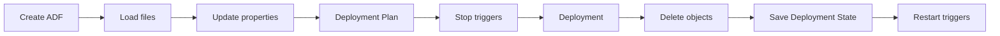

# Publishing Workflow

**Related:** [Getting Started](../GETTING_STARTED.md) | [Publish Options](PUBLISH_OPTIONS.md) | [Configuration](CONFIGURATION.md) | [Main Documentation](../../README.md)

## Overview

The `Publish-AdfV2FromJson` cmdlet orchestrates the entire deployment process. It reads ADF objects from JSON files and deploys them to Azure in the correct order.

### Deployment Steps



## Using Publish-AdfV2FromJson

### Basic Syntax

```powershell
Publish-AdfV2FromJson `
   -RootFolder <String> `
   -ResourceGroupName <String> `
   -DataFactoryName <String> `
   -Location <String> `
   [-Stage] <String> `
   [-Option] <AdfPublishOption> `
   [-Method] <String> `
   [-DryRun]
```

### Complete Example

```powershell
$SubscriptionName = 'Subscription'
Set-AzContext -Subscription $SubscriptionName

$ResourceGroupName = 'rg-devops-factory'
$DataFactoryName = 'SQLPlayerDemo'
$Location = 'NorthEurope'
$RootFolder = 'c:\GitHub\AdfName\'

Publish-AdfV2FromJson `
    -RootFolder $RootFolder `
    -ResourceGroupName $ResourceGroupName `
    -DataFactoryName $DataFactoryName `
    -Location $Location
```

## Publishing Method Parameter

The `-Method` parameter (optional) specifies which PowerShell module to use:

- **AzResource** (default): Uses `Az.Resources` module (recommended - handles Az.DataFactory bugs)
- **AzDataFactory**: Uses `Az.DataFactory` module directly

## Deployment Process Steps

### Step 1: Create ADF (if not exist)

**Log message:** `STEP: Verifying whether ADF exists...`

If the target ADF instance doesn't exist, the module creates it. You must have appropriate permissions and the `-Location` parameter is required for this action.

### Step 2: Load Files

**Log message:** `STEP: Reading Azure Data Factory from JSON files...`

Reads all local JSON files from the specified root folder and subdirectories (pipeline, dataset, linkedService, etc.).

### Step 3: Replace Environment-Specific Properties

**Log message:** `STEP: Replacing all properties environment-related...`

This step only executes if the `-Stage` parameter is provided. See [Configuration & Stages](CONFIGURATION.md) for details.

### Step 4: Determine Deployment Plan

**Log message:** `STEP: Determining the objects to be deployed...`

Identifies which objects should be deployed based on:
- Includes/Excludes lists from Publish Options
- Incremental deployment state (if enabled)

### Step 5: Stop Triggers

**Log message:** `STEP: Stopping triggers...`

Stops triggers based on configuration. Can be controlled via:
- `StopStartTriggers` option (default: true)
- `TriggerStopMethod` option (default: AllEnabled)

See [Selective Deployment](SELECTIVE_DEPLOYMENT.md) for detailed trigger logic.

### Step 6: Deploy ADF Objects

**Log message:** `STEP: Deployment of all ADF objects...`

The core deployment step. The module intelligently deploys objects in the correct order, handling dependencies automatically.

### Step 7: Save Deployment State

**Log message:** `STEP: Updating (incremental) deployment state...`

Saves deployment state to Azure Storage (MD5 hashes of deployed objects) for incremental deployment support. Only runs if `IncrementalDeployment = true`.

See [Incremental Deployment](INCREMENTAL_DEPLOYMENT.md) for details.

### Step 8: Delete Objects Not in Source

**Log message:** `STEP: Deleting objects not in source ...`

Removes objects from ADF service that don't exist in the source code. Controlled by `DeleteNotInSource` option in Publish Options.

### Step 9: Restart Triggers

**Log message:** `STEP: Starting triggers...`

Restarts triggers based on their configured state. Can be controlled via `TriggerStartMethod` option.

## Common Scenarios

### Deploy Entire ADF
```powershell
Publish-AdfV2FromJson -RootFolder $RootFolder `
  -ResourceGroupName $ResourceGroupName `
  -DataFactoryName $DataFactoryName `
  -Location $Location
```

### Deploy with Environment Replacement
```powershell
Publish-AdfV2FromJson -RootFolder $RootFolder `
  -ResourceGroupName $ResourceGroupName `
  -DataFactoryName $DataFactoryName `
  -Location $Location `
  -Stage 'UAT'  # Will load config-uat.csv
```

### Deploy Specific Objects Only
```powershell
$opt = New-AdfPublishOption
$opt.Includes.Add('pipeline.Copy*', '')
$opt.DeleteNotInSource = $false

Publish-AdfV2FromJson -RootFolder $RootFolder `
  -ResourceGroupName $ResourceGroupName `
  -DataFactoryName $DataFactoryName `
  -Location $Location `
  -Option $opt
```

See [Publish Options](PUBLISH_OPTIONS.md) for more filtering examples.

## See Also

- [Publish Options - Control What Gets Deployed](PUBLISH_OPTIONS.md)
- [Configuration - Environment-Specific Values](CONFIGURATION.md)
- [Selective Deployment - Advanced Trigger Logic](SELECTIVE_DEPLOYMENT.md)
- [Incremental Deployment - Speed Up CI/CD](INCREMENTAL_DEPLOYMENT.md)

---

[← Back to Main Documentation](../../README.md)
