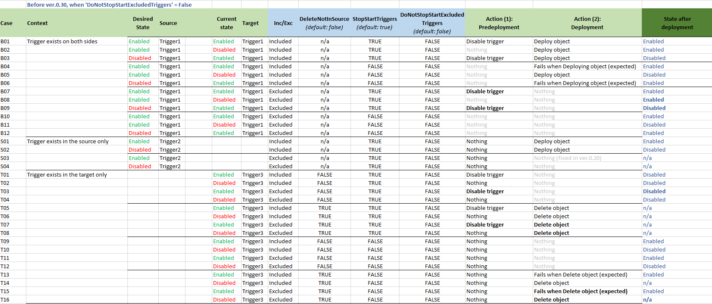
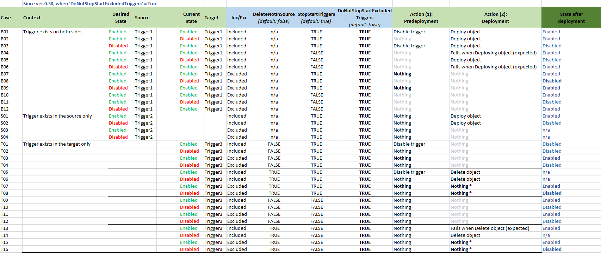

# Selective Deployment, Triggers & Logic

**Related:** [Publishing Options](PUBLISH_OPTIONS.md) | [Incremental Deployment](INCREMENTAL_DEPLOYMENT.md) | [Main Documentation](../../README.md)

## Overview

Selective deployment (excluding or including only certain objects) is powerful but complex. When combined with trigger management and object deletion, behavior depends on multiple flags and object states.

This guide explains the logic and provides a decision matrix.

## Key Concepts

### Includes & Excludes Lists

Objects can be:
1. **Explicitly included** - added to Includes list
2. **Explicitly excluded** - added to Excludes list  
3. **Neither** - implicitly handled based on rules

### Trigger State Scenarios

When deploying selectively:
- **Scenario 1**: New trigger in source → should it be enabled?
- **Scenario 2**: Existing trigger in target, not in source → should it be deleted?
- **Scenario 3**: Trigger excluded but deployment touches related object → stop the trigger?

### Object Deletion Scenarios

- **DeleteNotInSource = true**: Remove objects from target not in source
- **DoNotDeleteExcludedObjects = true**: Protect excluded objects from deletion
- **Conflict**: What if an excluded object exists in target but not source?

## Core Options Explained

### StopStartTriggers
Controls whether pipeline stops/restarts triggers before/after deployment.

- **true** (default): Process manages triggers → safe for most scenarios
- **false**: Triggers are untouched → you handle manually (pre/post script)

### DoNotStopStartExcludedTriggers

Only meaningful when `StopStartTriggers = true` AND some objects are excluded.

- **false** (default): Excluded triggers MAY be stopped if needed
- **true** (NEW in v0.30): Excluded triggers are NEVER stopped

**Use case**: Selective deployment where certain triggers must never be touched.

### DoNotDeleteExcludedObjects

Only meaningful when `DeleteNotInSource = true`.

- **false**: Excluded objects CAN be deleted if missing from source
- **true** (default): Excluded objects are PROTECTED from deletion

**Use case**: Keep infrastructure objects even if absent from source.

### TriggerStopMethod

Controls which triggers get stopped.

- **AllEnabled** (default): Stop ALL active triggers in target
- **DeployableOnly**: Stop only triggers being deployed

**Use case**: When doing selective deployment, use `DeployableOnly` to avoid disrupting unrelated triggers.

### TriggerStartMethod

Controls whether triggers are restarted based on source code or previous state.

- **BasedOnSourceCode** (default): Use source file status to determine restart
- **KeepPreviousState**: Restore state from before deployment (new triggers: disabled)

**Use case**: Avoid changing trigger status when doing selective deployment.

## Behavior Logic Matrix

### Version < 0.30 OR DoNotStopStartExcludedTriggers = false

This matrix shows behavior for:
- Different values of `DeleteNotInSource`
- Whether object is in source code or not
- Whether object is in Excludes list or not
- Whether trigger is Enabled in target



### Version >= 0.30 AND DoNotStopStartExcludedTriggers = true

This matrix shows behavior when using the newer flag to fully protect excluded objects.



## Common Scenarios

### Scenario 1: Deploy Only Pipelines, Protect Infrastructure

```powershell
$opt = New-AdfPublishOption

# Include only pipelines
$opt.Includes.Add('pipeline.*', '')

# Exclude infrastructure (won't be stopped/deleted)
$opt.Excludes.Add('integrationruntime.*', '')
$opt.Excludes.Add('linkedservice.*', '')
$opt.Excludes.Add('trigger.*', '')

# Protect excluded objects from deletion
$opt.DoNotDeleteExcludedObjects = $true

# Don't stop excluded triggers
$opt.DoNotStopStartExcludedTriggers = $true

# Don't delete objects outside includes
$opt.DeleteNotInSource = $false

# Only stop triggers being deployed
$opt.TriggerStopMethod = [TriggerStopMethod]::DeployableOnly

# Restore previous trigger states
$opt.TriggerStartMethod = [TriggerStartMethod]::KeepPreviousState
```

### Scenario 2: Deploy Infrastructure Only (No Pipelines)

```powershell
$opt = New-AdfPublishOption

# Include infrastructure only
$opt.Includes.Add('integrationruntime.*', '')
$opt.Includes.Add('linkedservice.*', '')

# Don't stop/start any triggers
$opt.StopStartTriggers = $false

# Don't delete pipelines/datasets
$opt.DeleteNotInSource = $false
```

### Scenario 3: Safe Cleanup - Remove Objects Not in Source

```powershell
$opt = New-AdfPublishOption

# Deploy everything
# (Includes is empty = all objects)

# Enable deletion for cleanup
$opt.DeleteNotInSource = $true

# But protect critical objects
$opt.Excludes.Add('linkedservice.LS_SharedKeyVault', '')
$opt.Excludes.Add('integrationruntime.IRHosted', '')

# Don't delete the excluded ones
$opt.DoNotDeleteExcludedObjects = $true

# Safe trigger handling
$opt.TriggerStopMethod = [TriggerStopMethod]::DeployableOnly
$opt.DoNotStopStartExcludedTriggers = $true
```

### Scenario 4: Hotfix - Update Single Pipeline

```powershell
$opt = New-AdfPublishOption

# Update only this pipeline
$opt.Includes.Add('pipeline.CriticalPipelineHotfix', '')

# Don't delete anything
$opt.DeleteNotInSource = $false

# Don't touch other triggers
$opt.TriggerStopMethod = [TriggerStopMethod]::DeployableOnly
$opt.TriggerStartMethod = [TriggerStartMethod]::KeepPreviousState

# Optionally: skip trigger management entirely
# $opt.StopStartTriggers = $false
```

## Understanding the Logic

### Why These Rules Exist

**Rule: Excluded objects are never deleted if DoNotDeleteExcludedObjects = true**
- Prevents accidental removal of infrastructure
- Allows selective deployment without losing shared resources

**Rule: DoNotStopStartExcludedTriggers prevents stopping excluded triggers**
- Ensures unrelated workflows continue running
- Necessary for safety in selective deployments

**Rule: TriggerStopMethod = DeployableOnly**
- Stops only triggers related to objects being deployed
- Enables safe multi-team deployments (team A deploys independently of team B)

**Rule: TriggerStartMethod = KeepPreviousState**
- Restores trigger state as they were before deployment
- Prevents unintended activation of disabled triggers

### Common Pitfall: Conflicting Options

❌ **DON'T DO:**
```powershell
$opt.Includes.Add('pipeline.A', '')      # Include only pipeline A
$opt.DeleteNotInSource = $true           # But delete everything else!
# Result: Pipelines B & C deleted, infrastructure may break
```

✅ **DO THIS INSTEAD:**
```powershell
$opt.Includes.Add('pipeline.A', '')      # Include only pipeline A
$opt.DeleteNotInSource = $false          # Don't delete other objects
$opt.TriggerStopMethod = [TriggerStopMethod]::DeployableOnly
```

## Decision Tree

Use this to determine the right option combination:

```
Do you want to DEPLOY everything?
├─ YES → Don't use Includes
└─ NO → Add specific items to Includes
         OR add unwanted items to Excludes

Do you want to DELETE objects not in source?
├─ NO → DeleteNotInSource = false
└─ YES → DeleteNotInSource = true
         Are there critical objects to protect?
         ├─ YES → Add to Excludes, set DoNotDeleteExcludedObjects = true
         └─ NO → Keep defaults

Do you have excluded objects with triggers?
├─ NO → Use defaults
└─ YES → Set DoNotStopStartExcludedTriggers = true

Are you doing selective deployment?
├─ NO → Use defaults (TriggerStopMethod = AllEnabled)
└─ YES → Set TriggerStopMethod = DeployableOnly
         Set TriggerStartMethod = KeepPreviousState
```

## See Also

- [Publish Options - Basic Filtering](PUBLISH_OPTIONS.md)
- [Publishing Workflow - Deployment Steps](PUBLISHING.md)
- [Incremental Deployment - Change Detection](INCREMENTAL_DEPLOYMENT.md)

---

[← Back to Main Documentation](../../README.md)
